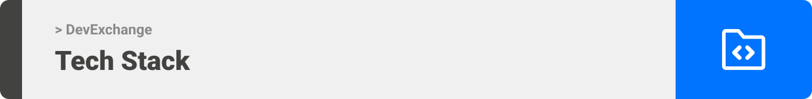

<div align="center">

> Hello world! This is the project’s summary that describes the project plain and simple, limited to the space available. 
 

**[PROJECT PHILOSOPHY](#project-philosophy) • [WIREFRAMES](#wireframes) • [TECH STACK](#tech-stack) • [IMPLEMENTATION](#implementation) • [HOW TO RUN?](#how-to-run)**

</div>

<br><br>


> The DevExchange app is a place where professional can exchange their to knowledge for money. 
> 
> Professionals (Tutors) can make money by getting up-votes on their answers or giving tutoring sessions based on their own hourly price. 

### User Stories
- As a user, I wain to search for my questions and look for the answers provided by professionals.
- As a user, I want to  post my own question and get a detailed answer from professionals.
- As a user, I waint to book a live tutoring session with one of the professionals.

<br><br>


> This design was planned before on paper, then moved to Figma app for the fine details.
Note that i didn't use any styling library or theme, all from scratch and using pure css modules

| Landing  | Home |
| -----------------| -----|
|  |  |

| Booking  | Meeting  |
| -----------------| -----|
|  |  |


<br><br>



Here's a brief high-level overview of the tech stack the Well app uses:

- This project uses the [React JS](https://reactjs.org/). React makes it painless to create interactive UIs. Design simple views for each state in your application, and React will efficiently update and render just the right components when your data changes.

- For persistent storage (database), the app uses the [Mongoose ODM](https://mongoosejs.com) package which allows the app to create a custom storage schema and save it to [MongoDB](https://www.mongodb.com).

- To send emails, the app uses the [Nodemailer](nodemailer.com/) package for NodeJS.


<br><br>


> Uing the above mentioned tech stacks and the wireframes build with figma from the user sotries we have, the implementation of the app is shown as below, these are screenshots from the real app

| Landing  | Tutros |
| -----------------| -----|
|  |  |


<br><br>


> Below are the instruction to setup and run both the frontend and the backend.
### Prerequisites

First thing, you need to have the latest npm version:
* npm
  ```sh
  npm install npm@latest -g
  ```

### Installation

1. Clone the repo
   ```sh
   git clone https://github.com/khaled-faour/DevExchange.git
   ```
   Here you will find two folders (forntend and backend)
   
2. Inside the frontend folder, run:
   ```sh
   npm install
   ```
   🚨 you might need to run `npm install --force`  if you face any dependency conflicts.
3. Rename `.env.example` to `.env` then set your [VideoSDK](https://www.videosdk.live/) REACT_APP_VIDEOSDK_API_KEY

4. Inside the backend folder, run:
  ```sh
  npm install
 ```
5. Rename `.env.example` to `.env` then set your `CLIENT_ID` and `SECRET_ID` for Google and Github Authentication.
Set your `MONGO_URI` to your MongoDB connection URI.
Set your `SMTP_HOST` `SMTP_PORT` `SMTP_USER` and `SMTP_PASSWORD`

6. You are ready to go, inside the backend folder and the frontend folder, run: 
```sh
  npm start
 ```
